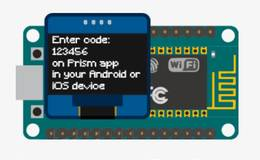
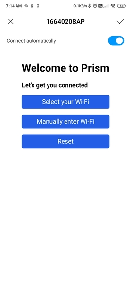
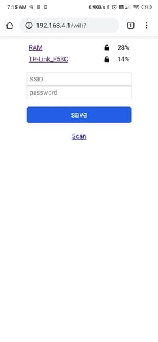
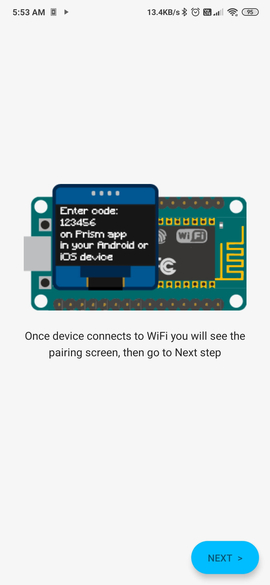
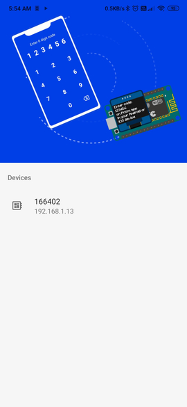
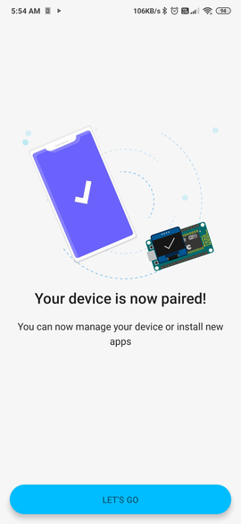
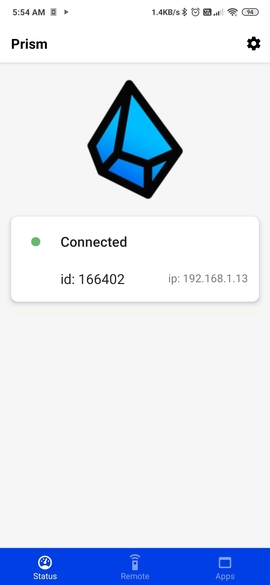

Prism OS devices pair with your Android or iOS running phone, where using the Prism app you can manage your device, install new apps, remove or manange existing apps, install os and app updates etc. Prism OS devices need Wi-Fi to connect to internet and pair with your phone over the same Wi-Fi network.  
To complete the setup of your device, you need to :
1. [Connect your device to your Wi-Fi network](connecting-with-device.md#connect-to-wi-fi)
2. [Pair the Prism app on your phone with your device](connecting-with-device.md#pair-with-prism-app-on-your-phone)

## Connect to Wi-Fi

1. The first time you turn on your device running Prism OS, it would create a Wi-Fi hotspot for you to connect to and enter the credentials for your Wi-Fi network.
2. Connect your phone to the Wi-Fi hotspot shown on the screen of your device.  

3. Once you are connected to the hotspot, your phone should show you a notification to take you to the config page, if it doesn't then you can manually open the browser app on your phone and go to `192.168.4.1`.
4. At this page you will be shown a list of Wi-Fi networks around you, and you can select your network's name, enter the password and connect. **Your password is sent to device locally and not sent to any server**.  

5. The device will try to connect to the network, and if it succeeds it will move to the pairing screen and turn off the hotspot at which point your phone should connect back to your original Wi-Fi network.  
If it fails to connect to the Wi-Fi network (for example, if the password entered was wrong), your device will remain on the hotspot and you can open `192.168.4.1` and try to connect again.

## Pair with Prism app on your phone

1. Once your device successfully connects to your Wi-Fi network it would start showing the pairing instructions on the screen along with a pairing code.  

2. Make sure your phone is on the same Wi-Fi network as the one you connected your device to and open the Prism app on your phone.
3. After logging in or creating a new account, you will be shown instructions on the app to pair with your device.
4. You need to select your device in the list of Prism OS devices detected by your phone in the network, and enter the pairing code shown on the screen of your device.  

5. Your phone will try to pair with the device and if it succeeds you will be taken to the Status screen which will show the status and info of your paired device.  

  
You are now successfully paired with the device and can go ahead and install new apps or manage your device.  
If the pairing fails (for example, if you entered the wrong pairing code) then you need to select your device and enter the pairing code again.
