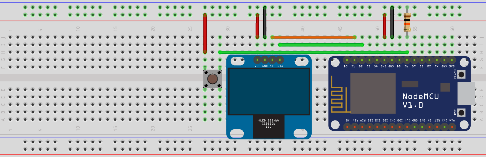

Thanks for showing interest in trying out Prism OS! We're glad you are here.  

Now, first thing we have to do is get you set up with a device running Prism OS.  
Currently Prism OS supports only ESP8266 with support for ESP32 coming soon.  
A basic device setup for Prism OS needs following parts:
1. ESP8266
2. SSD1306 display module with i2c pinout
3. Push button
4. 10k resistor
5. Some jumper wires

The basic setup mentioned above basically has the SSD1306 display module connected to the ESP8266 over i2c using the hardware i2c connection on ESP8266 and the push button connected to **gpio pin 12**.  
More configurable options will be enabled in future to accomodate more varied hardware setups.  

The schematic for the connections is as below:  

*(You can right click and open the image in a new tab or download it to see it bigger)*  
You can also download and use the fritzing file of the developer board as reference: [prism-dev-board-1.0.fzz](assets/prism-dev-board-1.0.fzz)  

Once you have the developer board above setup, you can install the initial Prism OS image using command:  
```bash
prismtool install
```
You will need to get and setup the prism cli before running the above command, refer to [Setup Prism CLI](setup-prism-cli.md) section.
